<div align="center">

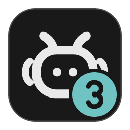

# AgentCodeGUI

### A desktop workspace for Claude Code and Codex

Describe the work, watch it unfold, review the changes, and commit.<br>
The whole day of a terminal coding agent, on one screen.

[한국어](README.md) · **English**

[](https://github.com/UnrealFactory/AgentCodeGUI/releases/latest)
[](https://github.com/UnrealFactory/AgentCodeGUI/releases)
[](https://github.com/UnrealFactory/AgentCodeGUI/stargazers)


[](LICENSE)

[**Download for Windows →**](https://github.com/UnrealFactory/AgentCodeGUI/releases/latest) · [Release notes](https://github.com/UnrealFactory/AgentCodeGUI/releases) · [Report a bug · Request a feature](https://github.com/UnrealFactory/AgentCodeGUI/issues)

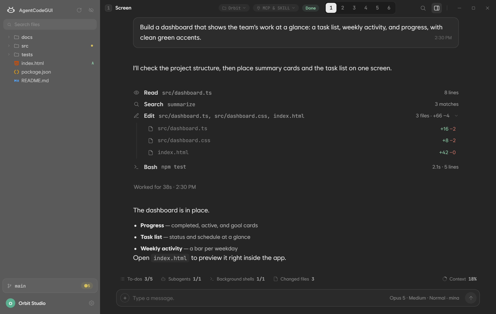

<sub>Actual app, version 3.0.13 · Orbit example project · the conversation, accounts, and usage shown are sample data</sub>

</div>

<br>

## Quick start

1. Download `AgentCodeGUI3_<version>_x64-setup.exe` from the [latest release](https://github.com/UnrealFactory/AgentCodeGUI/releases/latest) and run it. No administrator rights needed.
2. Install an engine on first launch, or choose the **system environment** under Settings › Engine to connect the Claude Code · Codex already on your PC.
3. Sign in with a subscription account under Settings › Account, or add an API key.
4. Pick a working folder and send your first message.

**Requirements** — Windows 10/11 x64 · a Claude or ChatGPT subscription (or an API key) · Node.js (npm) if you want the app to install engines for you. The installer adds WebView2 on PCs that lack it.

<sub>[Why a GUI](#terminal-agents-finally-visible) · [Review code](#ask-for-a-change-then-open-the-files-it-touched) · [Track progress](#never-lose-track-of-progress) · [Questions and plans](#answer-questions-review-plans) · [Multi-agent](#agents-side-by-side) · [Accounts and limits](#accounts-and-limits-handled-by-the-app) · [Tools](#bring-your-tools) · [Git](#finish-with-git) · [Engines](#engines-and-models) · [Install and FAQ](#install) · [Development](#development)</sub>

<br>

## Terminal agents, finally visible

Claude Code and Codex CLI are powerful, but knowing what they are doing right now means scrolling back through a terminal. AgentCodeGUI runs both engines **as they are** and lays every move out on screen.

| In a terminal | In AgentCodeGUI |
|---|---|
| Scroll back to find a tool's output | Click a tool row to open the full request and result as a card |
| Run `git diff` to see what changed | Expand an Edit row for per-file `+/−`, click a file to open a viewer with the changed lines marked |
| Hard to tell how far subagents and background jobs have gone | To-dos, subagents, background shells, changed files, and context sit in the work bar at all times |
| One terminal per account, switched by hand when a limit hits | Register accounts once and pick one per chat. When a limit hits, hop to another account or resume automatically at reset time |
| Open more windows to split the work | Up to six panels in one window, each with its own engine, model, account, and folder |

AgentCodeGUI focuses on three things: **both engines in one window**, **several subscription accounts with limit handling**, and **up to six panels working at once**. Everything else a coding day needs, from the code viewer to Git and MCP, is built on top of that.

<br>

## Ask for a change, then open the files it touched

Replies and tool activity stay in order in one conversation. **Expand an Edit row** to see added and removed lines per file, and click a file to open a code viewer with this run's changes marked.

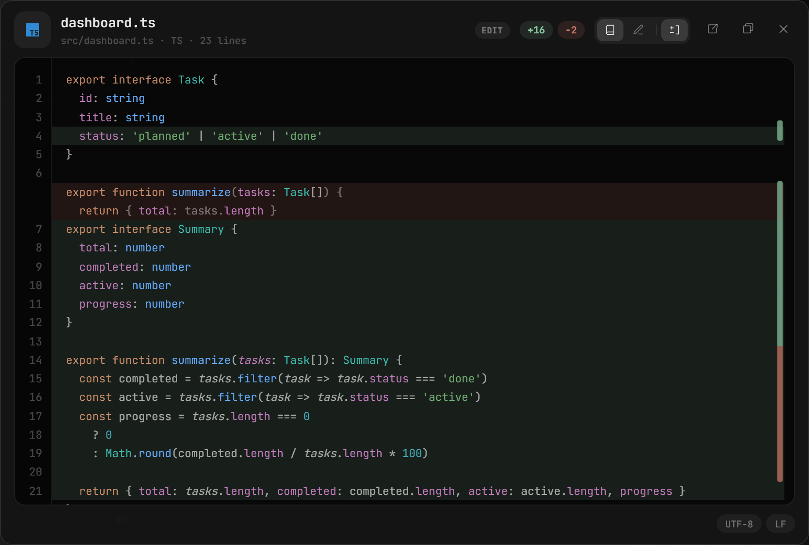

<sub>Added lines in green, deleted lines left as ghosts where they were</sub>

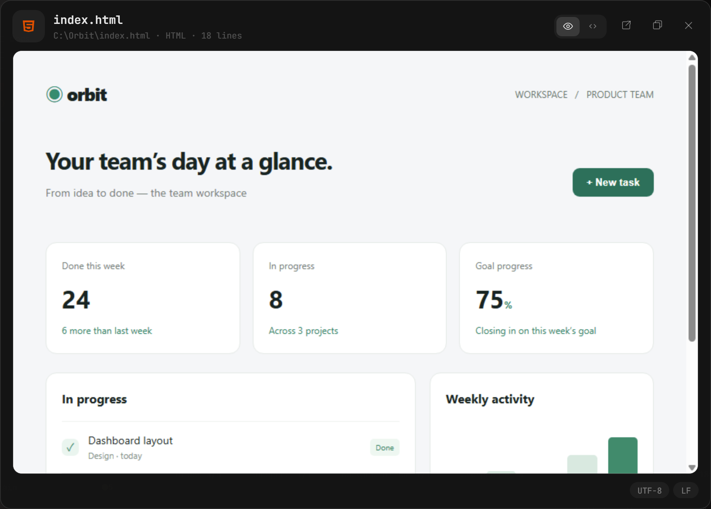

<sub>HTML renders as a page, Markdown as a document</sub>

- **File explorer and code viewer** — file search, read and edit modes (`Ctrl+E`), save (`Ctrl+S`), change marks toggle (`Ctrl+D`), viewer in its own window
- **Code intelligence** — go to definition (`F12`), hover docs, completion. TypeScript, JavaScript, and Python work with nothing to install; C# and C/C++ are one click away in Settings
- **Previews** — HTML pages, Markdown documents, images and SVG. Local images attached in chat display inline and open in the image viewer when clicked
- **Tool cards** — inspect and copy full Bash commands, output and exit codes, plus MCP arguments, responses and errors
- **Web activity** — expand Codex search queries and result links, including page-open and in-page search details when supplied by the engine

<br>

## Never lose track of progress

When Claude Code's Workflow tool runs several agents in stages, a **stage rail with per-agent progress** opens. Every agent shows its model, tokens, and tool calls, and you can stop the whole thing from the card.

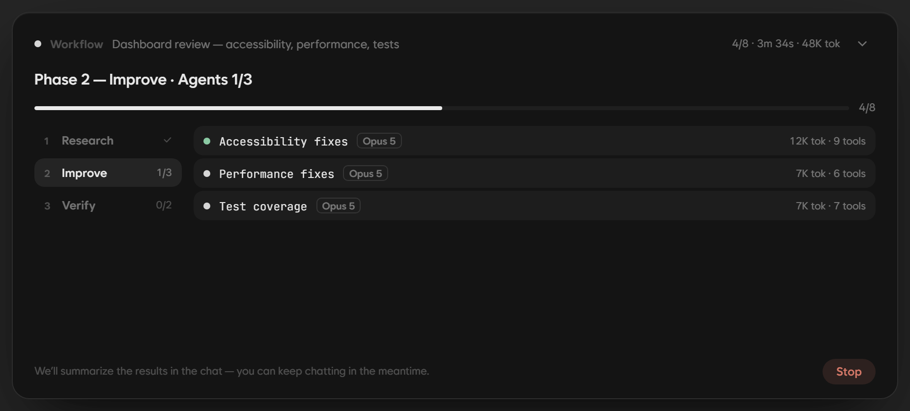

The five chips in the work bar are always visible. Click one for the list, then click an item for a detail card such as a subagent log or a shell's output.

**Open the tools a subagent used, too.** Read opens the file; Bash, Search and MCP open request/result cards; Web expands queries and result links. Close, `Esc` or a left mouse gesture returns to the previous card.

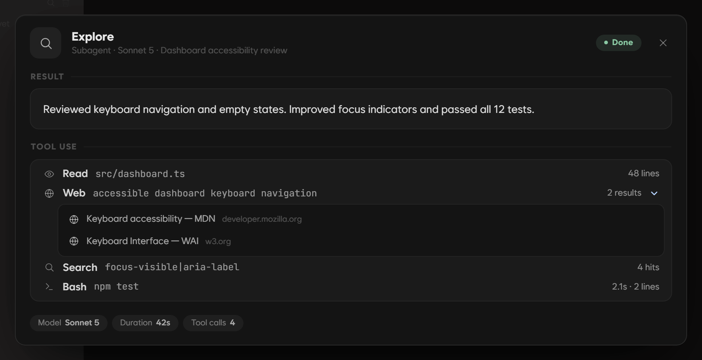

<sub>Actual app, version 3.1.0 · tool activity and search results are sample data</sub>

<table>
<tr>
<td width="33%" align="center">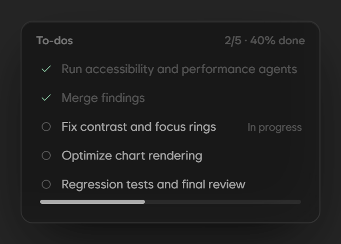</td>
<td width="33%" align="center">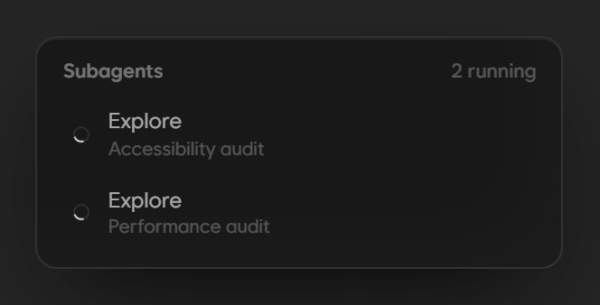</td>
<td width="33%" align="center">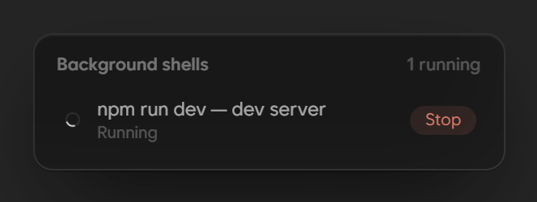</td>
</tr>
<tr>
<td align="center"><sub>To-dos — the agent's plan and progress</sub></td>
<td align="center"><sub>Subagents — helper agents in flight</sub></td>
<td align="center"><sub>Background shells — long jobs like a dev server, stoppable in place</sub></td>
</tr>
</table>

- **Changed files** — everything created or edited in this run, with diffs
- **Context** — how much of the context window this chat uses, 5-hour and weekly limits, token totals (see Accounts below)
- **Keep going while it works** — messages sent mid-turn are queued and go out when the turn ends. A toast appears if the window is not focused when it finishes
- **Notices you can tell apart at a glance** — limit waits, automatic account and model switches, stops, queued messages, and CLI warnings each get their own color and label. Server retries show the reason, attempt count, and time left

<br>

## Answer questions, review plans

Questions and permission requests from the agent arrive as cards. In plan mode you **read the plan document inside the app** and approve it or send it back.

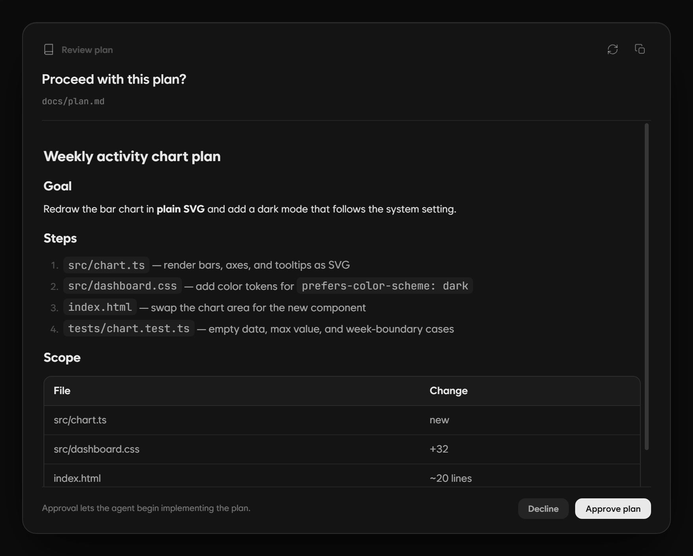

<sub>Plan review — Markdown preview · reload · copy · approve or decline</sub>

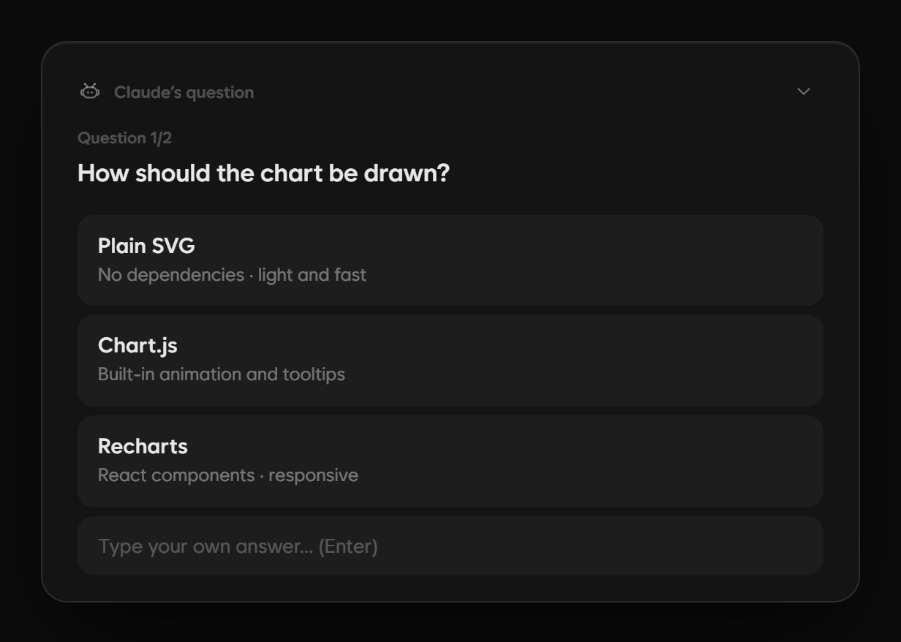

<sub>Question card — pick an option or type your own; multiple questions go step by step</sub>

- **Permission cards** — allow once, allow for this session, or deny. Per chat, choose a permission mode: normal, plan, partial, auto, or allow all
- **Decisions stay** — answers and plan approvals are recorded in the chat and survive reopening it
- **Codex questions during a task** — answer in a card without manually stopping the work. Failed sends preserve your input for retry
- **Side questions** — In both Claude Code and Codex, `/btw question` opens a separate window with the current chat's context. The main task keeps running, and questions and replies stay in the side window.

<br>

## Agents side by side

Build the screen in one panel, connect the API in another, review in a third. Give each of **up to six panels** its own engine, model, reasoning effort, permission mode, account, and working folder.

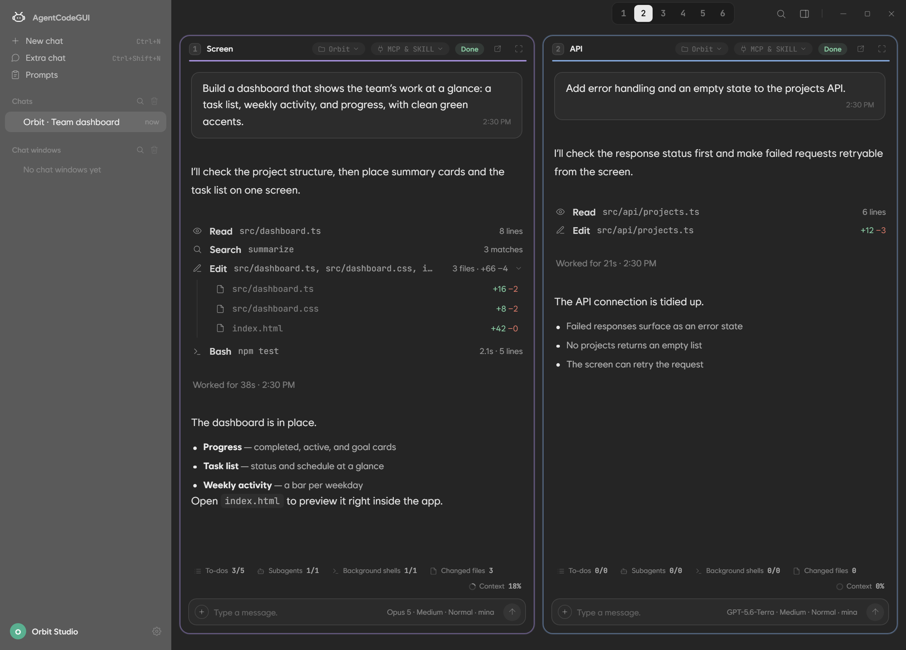

<sub>Two panels shown. The 1–6 dial in the header adds more</sub>

- Change the panel count from 1 to 6, drag headers to reorder, expand a panel or **pop it out into its own window**
- Every panel has its own work bar and MCP & Skill chip; collapsed panels keep their conversations
- Open an extra chat window (`Ctrl+Shift+N`) next to other work
- The explorer follows the focused panel's folder

<br>

## Accounts and limits, handled by the app

Register several Anthropic and OpenAI subscription accounts and pick one per chat. Each card shows **5-hour and weekly limits with reset times** as gauges (Anthropic cards add the Fable model-specific weekly limit), sortable by soonest reset or least remaining.

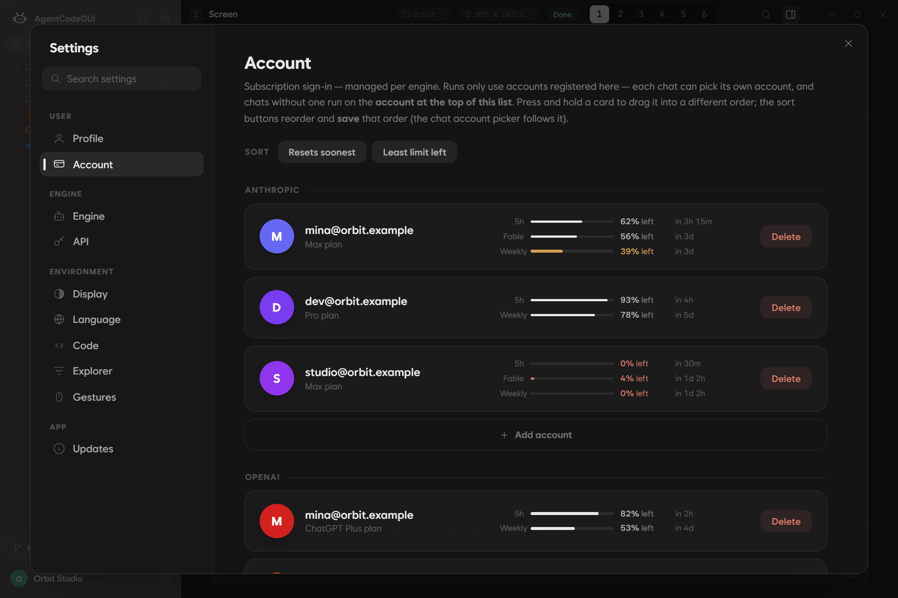

<table>
<tr>
<td width="50%" align="center">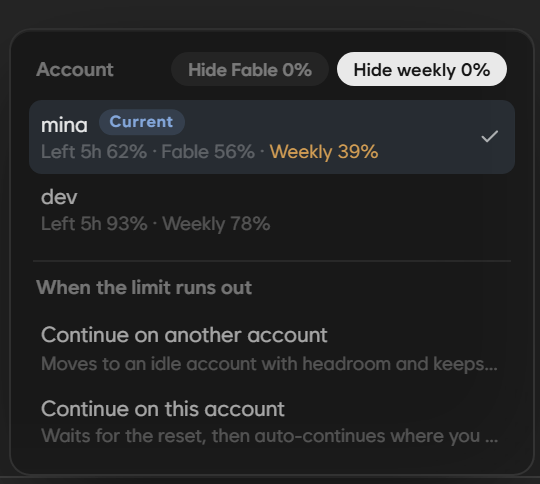</td>
<td width="50%" align="center">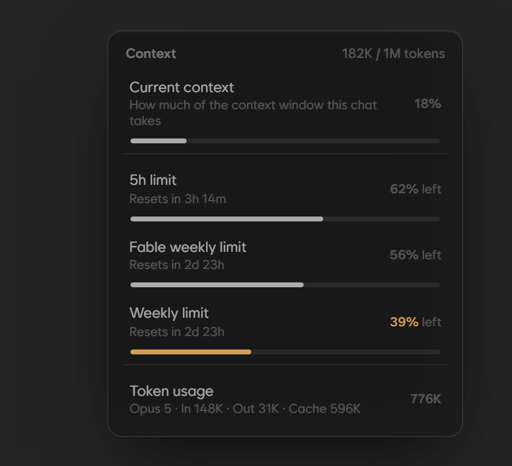</td>
</tr>
<tr>
<td align="center"><sub>Account picker in the chat — current account, hide exhausted accounts, what to do when a limit hits</sub></td>
<td align="center"><sub>Context chip — context window use and this account's remaining limits</sub></td>
</tr>
</table>

- **When a limit runs out**, continue on another account with headroom, or resume where you stopped when the current account resets
- **Codex resets** — click the balance on an OpenAI account card to see available grant/expiry details and use a reset manually. Unconfirmed requests reuse the same request on retry to prevent double spending. Availability depends on the account and Codex version
- **Who is using what** — when another panel uses the same account, it shows as "In use · Slot N"
- **API keys work too** — add a key under Settings › API to run without a subscription. With an Anthropic key you also get per-chat cost, cumulative spend, and a budget
- **Credentials are encrypted (DPAPI) in the app home** and never mixed with your terminal's Claude Code or Codex login. To reuse a CLI and login already on your PC, pick the **system environment** below

<br>

## Bring your tools

<table>
<tr>
<td width="40%" align="center">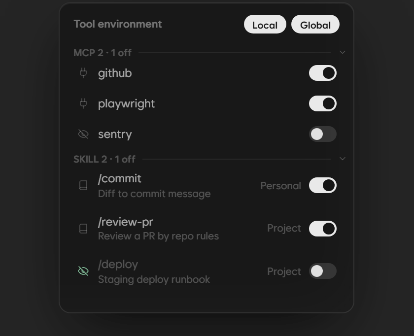</td>
<td width="60%" valign="top">

- **MCP servers and skills** exactly as the engine sees them — global (`~/.claude.json`, `~/.claude/skills`), project (`.mcp.json`, `.claude/skills`), and plugin skills
- **Local and Global filters** narrow the list; supported items toggle on and off. The app never rewrites your configuration files
- Codex loads the MCP servers and skills of the selected account and folder too; toggles are saved per account and apply on the next run
- Insert skills with Claude's `/` or Codex's `$` completion. Mention files with `@`, attach images and text, and keep frequent instructions in the prompt library

</td>
</tr>
</table>

<br>

## Finish with Git

Click the Git strip under the explorer to open the change list and commit composer. Write the message yourself or **let the AI draft it** (choose Anthropic or OpenAI, an account, a model, and reasoning effort).

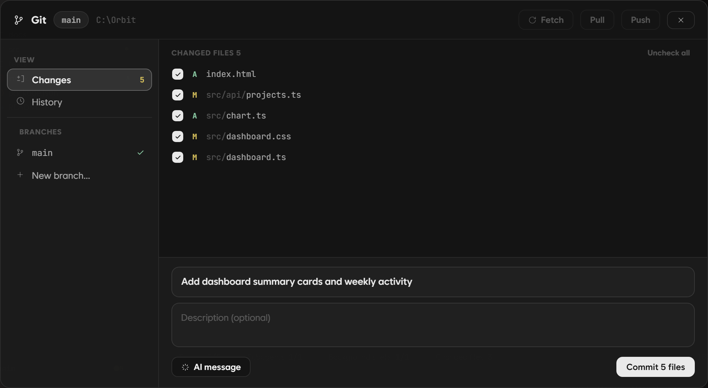

<sub>Changes — pick files, write the message, commit. Switch or create branches on the left</sub>

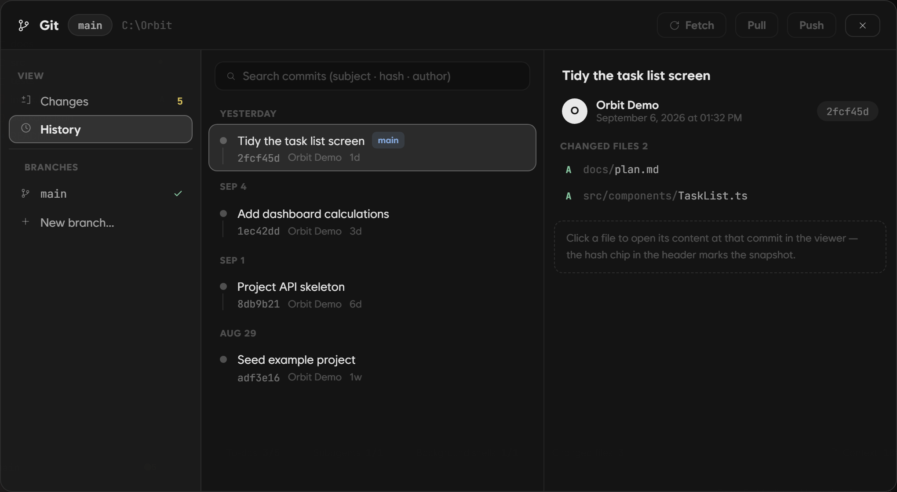

<sub>History — commit details and the files as they were</sub>

- Select files → commit → pull and push. Discarding changes and switching a dirty branch ask for confirmation first
- Open commit details from history, including **the file as it was at that commit**
- Switch and create branches; pick a repository when a folder contains several
- Deleting from the explorer goes to the Recycle Bin, so it can be undone

<br>

## Engines and models

| Engine | Sign in with | Per-chat settings |
|---|---|---|
| **Claude Code** · Anthropic | Claude subscription account or API key | Model · reasoning effort · permission mode |
| **Codex CLI** · OpenAI | ChatGPT subscription account or API key | Model · reasoning effort · speed option (supported models) |

- **App-managed environment** — the app installs and updates the engine. Pick a version and clean up old ones under Settings › Engine (installation needs npm from Node.js)
- **System environment** — use the CLI already installed on your PC with its login and settings. Detects the executable and config folder, or set them yourself. A change takes effect for new chats after the app restarts
- Output style (Concise, Explanatory, Learning, …) is chosen under Settings › Engine as well

**Adjust Codex context per model.** Settings › Engine shows context windows and auto-compaction thresholds for the models available in chat. **Default** is selected initially; choose and save **Recommended**, or enter **Custom** values when needed. Recommended currently uses 512,000 / 430,000 tokens for Astra and keeps other models at their defaults.

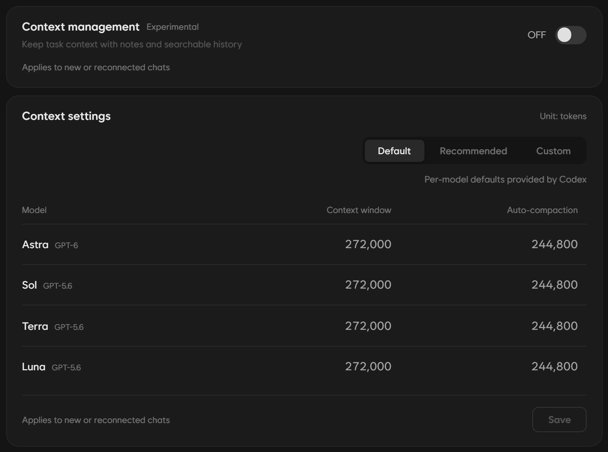

<sub>Context management is experimental and starts OFF. The switch saves automatically; model values use a Save button. Both apply to new or reconnected chats</sub>

**Context management**, which uses notes and searchable history, is independent of **context window settings**. Your existing Codex configuration file stays unchanged. The chat gauge shows the usable capacity reported by the engine, which may differ from the value you entered.

<br>

<details>
<summary><b>More features — expand</b></summary>
<br>

| Area | Features |
|---|---|
| **Chat** | `Ctrl+F` search · recall sent messages · selection toolbar (copy, translate, explain more) · `/clear` `/compact` `/init` result cards · image lightbox · links open in the default browser · `Ctrl+wheel` zoom · mouse gestures |
| **Archive** | conversation, command, and tool originals with actual file snapshots · before-and-after contents · session search, rename, and deletion · import a session folder on another computer · [usage guide](docs/conversation-archive.md) |
| **Translation** | translate selected passages with the current session's provider and account · copy results and change languages · choose language, model, effort, and supported speed in Settings › Translation |
| **Viewer** | ask about selected code · find in viewer · file history (back / forward) · maximize · separate OS window that remembers its position · partial display for huge files · Git commit snapshots |
| **Explorer** | file search · hidden-item filters · new file / folder · rename · copy path · reveal in File Explorer · show changed files · track a nested repository in Git from its folder's context menu |
| **Window · system** | acrylic glass · sidebar auto-hide · close button hides to tray · aggregated toasts · English / Korean UI · app updates and patch notes under Settings › Updates |
| **Reliability** | the app manages engine state so switching account, model, or mode mid-chat never tangles · the app recovers a dead view by itself · child processes are cleaned up on exit · a diagnostic dump is written if the UI stops responding |

</details>

<br>

## Install

The four steps under [Quick start](#quick-start) are the whole installation. A few more things worth knowing:

- **The file** — `AgentCodeGUI3_<version>_x64-setup.exe` from the [latest release](https://github.com/UnrealFactory/AgentCodeGUI/releases/latest), about 30 MB. It installs for the current user only, under `%LOCALAPPDATA%\AgentCodeGUI3`.
- **Updates** — check and install under **Settings › Updates** inside the app. Patch notes live there too.
- **Uninstall** — remove AgentCodeGUI3 from Windows Settings › Apps. Your chats and settings in `~/.agentcodegui3` stay behind; delete the folder if you want them gone.

<details>
<summary>If Windows SmartScreen appears during installation</summary>
<br>

Current releases do not carry a Windows code-signing certificate. After checking that the file came from the official release, use **More info → Run anyway** to install. In-app updates are verified with a separate updater signature.

</details>

<details>
<summary>Frequently asked questions</summary>
<br>

**Subscription account or API key?**<br>
Both work. With a subscription the app tracks your limits and helps you switch or resume when they run out. An API key is pay-as-you-go; with an Anthropic key you also see per-chat cost, cumulative spend, and a budget.

**Does it reuse my terminal's Claude Code login?**<br>
In the default (app-managed) environment you sign in separately into the app home (`~/.agentcodegui3`), apart from your terminal login. Choose the **system environment** under Settings › Engine to use the CLI, login, and settings already on your PC.

**Where is my data?**<br>
Chats, settings, and accounts live locally in `~/.agentcodegui3`, and account tokens are encrypted with Windows DPAPI. Your conversation goes out through the engines (Claude Code · Codex CLI) alone. Beyond that, the app itself contacts Anthropic's sign-in and usage APIs (the OpenAI side is handled by Codex CLI), GitHub for update checks, jsDelivr and Google Fonts for the UI typefaces, and, only when you choose them, the npm registry (app-managed engine install) and GitHub/NuGet (language-server install). There is no analytics or telemetry server.

**What do I need to install an engine?**<br>
The app-managed environment needs Node.js (npm). If the CLI is already installed, connect it as a system environment and npm is not required.

**I was using 2.6.x. What changes?**<br>
3.x installs side by side as a separate app and leaves 2.6.x untouched. The app home moved to `~/.agentcodegui3`, so chats and logins do not carry over; sign in once more. 2.x auto-update cannot deliver 3.x, so install it from the releases page.

**macOS or Linux?**<br>
Windows only for now. The app is built on Tauri 2, so nothing rules out other platforms, but it is currently tested and shipped on Windows.

</details>

<br>

## Development

Version 3.x is **Tauri 2 · Rust · React · TypeScript**. You need Node.js 22 or later, Rust 1.82 or later, and the Windows C++ build tools.

```bash
npm install
npm run tauri:dev              # launch the development app
npm run typecheck:app          # type-check the renderer
cargo test --workspace         # Rust tests
npm run tauri:build:unsigned   # local test installer
```

| Path | Purpose |
|---|---|
| `app/src` | React renderer — chat, multi-panel, viewer, settings |
| `src-tauri` | App shell — windows, tray, IPC dispatcher, engine hub, updater |
| `crates/ccg-engine` | Claude Code · Codex CLI drivers and the turn state machine |
| `crates/ccg-auth` | Account store, sign-in, usage API, limit switching |
| `crates/ccg-store` · `ccg-fs` · `ccg-lsp` | Storage, file system and Git, language servers |
| `src/shared/protocol.ts` | The IPC contract shared by renderer and shell |

For distribution, configure the updater signing key and run `npm run tauri:build`. Recapture the README screenshots with `node scripts/readme-screenshots.mjs`; it drives the real app in an isolated home with a scripted fake CLI, so no account or model calls are involved.

<br>

---

<div align="center">

**Help make the app better.** Share [bugs and ideas](https://github.com/UnrealFactory/AgentCodeGUI/issues), or leave a [⭐ Star](https://github.com/UnrealFactory/AgentCodeGUI/stargazers) if you enjoy using it.

[MIT License](LICENSE)

</div>
