<div align="center">


# AgentCodeGUI

### Claude Code와 Codex를 위한 데스크톱 작업실

말로 시키고, 진행을 지켜보고, 바뀐 코드를 확인하고, 커밋까지.<br>
터미널 코딩 에이전트의 하루를 한 화면에 담았습니다.

**한국어** · [English](README.en.md)

[](https://github.com/UnrealFactory/AgentCodeGUI/releases/latest)
[](https://github.com/UnrealFactory/AgentCodeGUI/releases)
[](https://github.com/UnrealFactory/AgentCodeGUI/stargazers)


[](LICENSE)

[**Windows용 다운로드 →**](https://github.com/UnrealFactory/AgentCodeGUI/releases/latest) · [릴리스 노트](https://github.com/UnrealFactory/AgentCodeGUI/releases) · [버그 제보 · 기능 제안](https://github.com/UnrealFactory/AgentCodeGUI/issues)

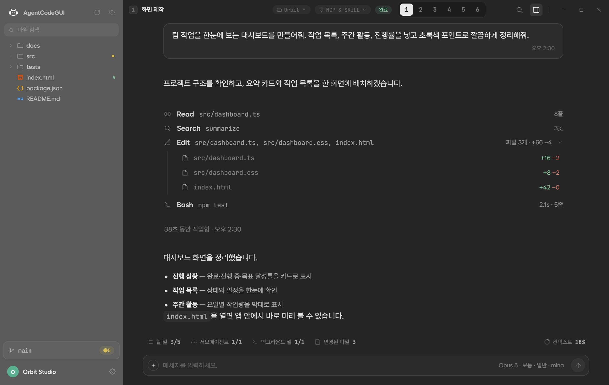

<sub>3.0.13 실제 앱 화면 · 예제 프로젝트 Orbit · 대화 내용과 계정·사용량은 예시 데이터입니다</sub>

</div>

<br>

## 빠른 시작

1. [최신 릴리스](https://github.com/UnrealFactory/AgentCodeGUI/releases/latest)에서 `AgentCodeGUI3_<버전>_x64-setup.exe`를 받아 실행합니다. 관리자 권한은 필요 없습니다.
2. 첫 실행에서 엔진을 설치하거나, 설정 › Engine에서 **시스템 환경**을 골라 PC에 있는 Claude Code · Codex를 연결합니다.
3. 설정 › Account에서 구독 계정으로 로그인하거나 API 키를 등록합니다.
4. 작업 폴더를 고르고 첫 메시지를 보냅니다.

**필요한 것** — Windows 10/11 x64 · Claude 또는 ChatGPT 구독(혹은 API 키) · 앱이 엔진을 설치하게 하려면 Node.js(npm). WebView2가 없는 PC에는 설치 파일이 함께 설치합니다.

<sub>[왜 GUI인가](#터미널-에이전트-이제-눈으로-봅니다) · [코드 확인](#요청하고-바뀐-파일을-바로-열어-봅니다) · [진행 추적](#진행-상황을-놓치지-않습니다) · [질문과 계획](#물어보면-답하고-계획은-검토합니다) · [멀티 에이전트](#여러-에이전트를-나란히) · [계정과 한도](#계정과-한도는-앱이-관리합니다) · [도구](#내-도구를-그대로) · [Git](#마무리는-git으로) · [엔진](#엔진과-모델) · [설치와 FAQ](#설치하기) · [개발](#개발하기)</sub>

<br>

## 터미널 에이전트, 이제 눈으로 봅니다

Claude Code와 Codex CLI는 강력하지만, 지금 무엇을 하고 있는지 알려면 터미널을 거슬러 올라가야 합니다. AgentCodeGUI는 두 엔진을 **그대로** 쓰면서 에이전트의 모든 움직임을 화면에 펼칩니다.

| 터미널에서는 | AgentCodeGUI에서는 |
|---|---|
| 도구 출력을 찾아 스크롤을 거슬러 올라갑니다 | 도구 행을 클릭하면 요청과 결과 전문이 카드로 열립니다 |
| `git diff`로 무엇이 바뀌었는지 확인합니다 | Edit 행을 펼쳐 파일별 `+/−`를 보고, 클릭하면 변경 표시가 켜진 뷰어가 열립니다 |
| 서브에이전트와 백그라운드 작업이 어디까지 갔는지 알기 어렵습니다 | 할 일 · 서브에이전트 · 백그라운드 셸 · 변경 파일 · 컨텍스트가 작업 바에 항상 떠 있습니다 |
| 계정마다 터미널을 따로 띄우고 한도가 차면 손으로 바꿉니다 | 계정을 등록해 두고 대화마다 고릅니다. 한도가 차면 다른 계정으로 넘어가거나 초기화 시각에 자동 재개합니다 |
| 작업을 나누려면 창을 여러 개 띄웁니다 | 한 창에서 최대 6개 패널을 각각 다른 엔진·모델·계정·폴더로 돌립니다 |

AgentCodeGUI가 힘주는 것은 셋입니다. **두 엔진을 한 창에서**, **구독 계정 여러 개와 한도 관리**, 그리고 **최대 6개 패널의 동시 작업**. 그 위에 코드 뷰어·Git·MCP 같은 하루의 나머지를 얹었습니다.

<br>

## 요청하고, 바뀐 파일을 바로 열어 봅니다

답변과 도구 실행이 한 대화에 순서대로 남습니다. **Edit 행을 펼치면** 파일별 추가·삭제 줄 수가 보이고, 파일을 클릭하면 이번 작업에서 바뀐 줄이 표시된 코드 뷰어가 열립니다.

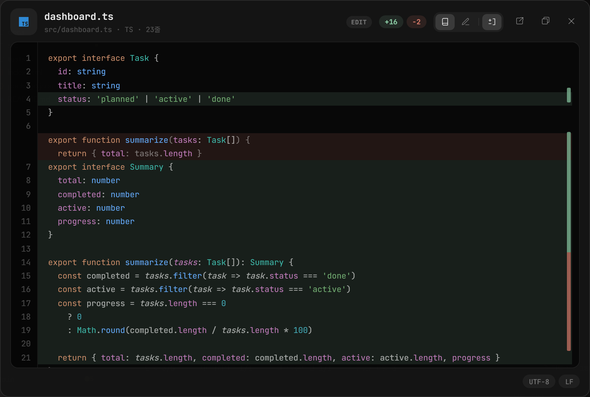

<sub>추가된 줄은 초록, 삭제된 줄은 그 자리에 흐리게 남습니다</sub>

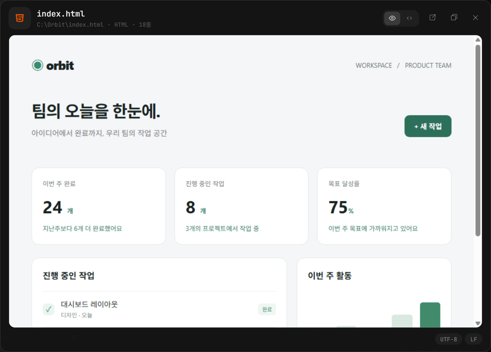

<sub>HTML은 렌더링된 화면으로, Markdown은 문서로 미리 봅니다</sub>

- **파일 탐색기와 코드 뷰어** — 파일 검색, 읽기·편집 모드(`Ctrl+E`), 저장(`Ctrl+S`), 변경 표시 토글(`Ctrl+D`), 뷰어를 별도 창으로 분리
- **코드 인텔리전스** — 정의로 이동(`F12`), 호버 설명, 자동완성. TypeScript·JavaScript·Python은 설치 없이, C#·C/C++는 설정에서 원클릭
- **미리보기** — HTML 페이지, Markdown 문서, 이미지·SVG. 대화에 첨부된 로컬 이미지도 바로 보고 클릭해 확대
- **도구 카드** — Bash의 전체 명령·출력·종료 코드, MCP 도구의 요청 인자·응답·오류를 행 클릭으로 확인하고 복사
- **Web 검색 내역** — Codex가 검색한 문구와 찾은 페이지를 펼쳐 확인. 엔진이 전달한 페이지 열기·본문 찾기 정보도 함께 표시

<br>

## 진행 상황을 놓치지 않습니다

Claude Code의 Workflow 도구가 여러 에이전트를 단계별로 돌리면 **단계 레일과 에이전트별 진행 카드**가 열립니다. 에이전트마다 모델·토큰·도구 호출 수가 보이고, 카드에서 바로 중지할 수 있습니다.

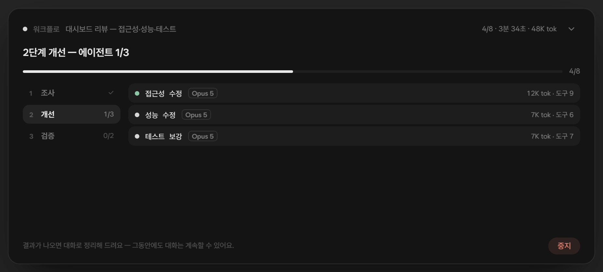

작업 바의 다섯 칩은 항상 떠 있습니다. 클릭하면 목록이 열리고, 항목을 누르면 서브에이전트 로그나 셸 출력 같은 상세 카드로 이어집니다.

**서브에이전트가 쓴 도구도 직접 열어 봅니다.** Read는 파일로, Bash·Search·MCP는 요청과 결과 카드로 이어지고, Web은 검색어와 결과 링크를 펼칩니다. 상세 화면에서 닫기·`Esc`·왼쪽 마우스 제스처로 이전 카드에 돌아옵니다.

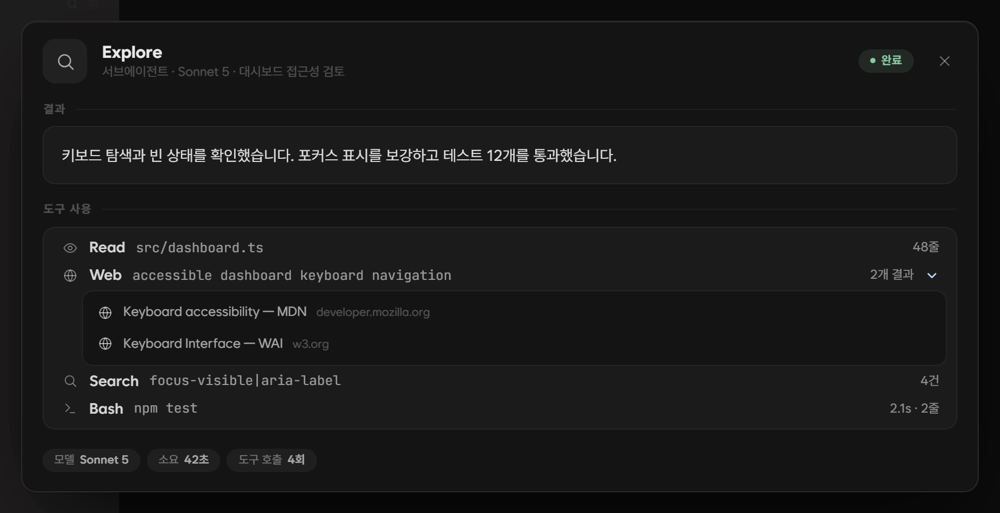

<sub>3.1.0 실제 앱 화면 · 도구 내역과 검색 결과는 예시 데이터입니다</sub>

<table>
<tr>
<td width="33%" align="center">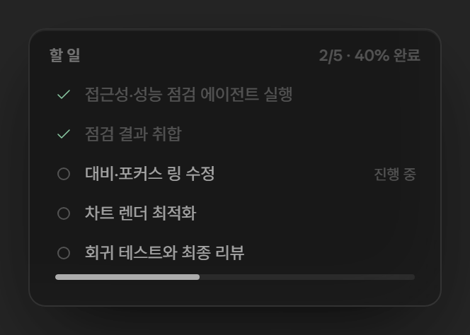</td>
<td width="33%" align="center">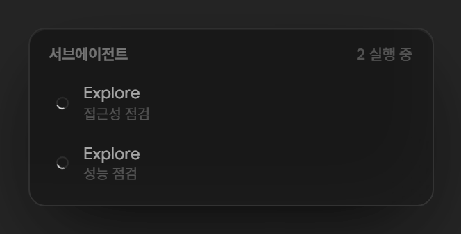</td>
<td width="33%" align="center">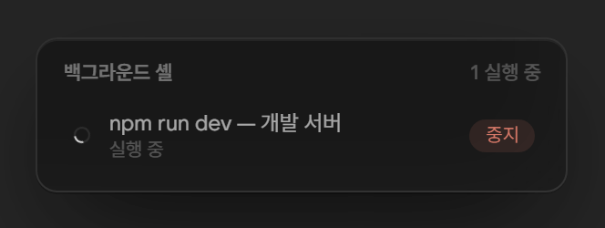</td>
</tr>
<tr>
<td align="center"><sub>할 일 — 에이전트가 세운 계획과 진행률</sub></td>
<td align="center"><sub>서브에이전트 — 실행 중인 보조 에이전트</sub></td>
<td align="center"><sub>백그라운드 셸 — 개발 서버 같은 장기 작업, 바로 중지</sub></td>
</tr>
</table>

- **변경된 파일** — 이번 작업에서 생성·수정된 파일 목록과 diff
- **컨텍스트** — 대화가 차지하는 컨텍스트 창, 5시간·주간 한도, 토큰 사용량 (아래 계정 절 참고)
- **작업 중에도 계속** — 답이 오는 동안 보낸 메시지는 예약되어 턴이 끝나면 자동 전송. 창이 비활성일 때 끝나면 알림 토스트
- **한눈에 구분되는 안내** — 한도 대기, 계정·모델 자동 전환, 중지, 예약, CLI 경고를 주제별 색과 라벨로 구분. 서버 오류로 재시도할 때는 사유·횟수·남은 시간 표시

<br>

## 물어보면 답하고, 계획은 검토합니다

에이전트가 던지는 질문과 권한 요청은 카드로 뜹니다. 플랜 모드에서는 **계획 문서를 앱 안에서 읽고** 승인하거나 되돌려 보냅니다.

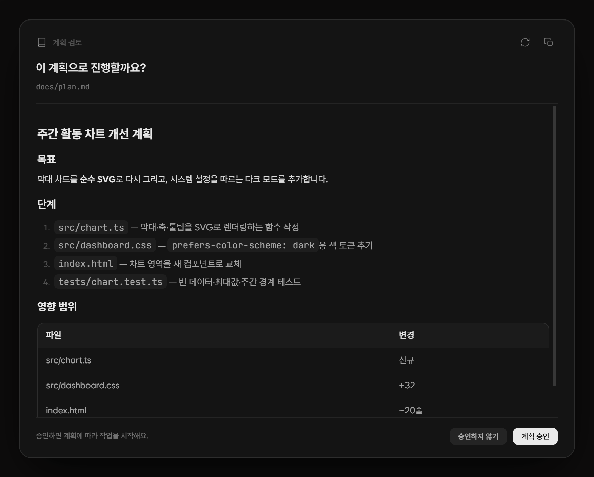

<sub>계획 검토 — Markdown 계획 미리보기 · 새로고침 · 복사 · 승인 / 승인하지 않기</sub>

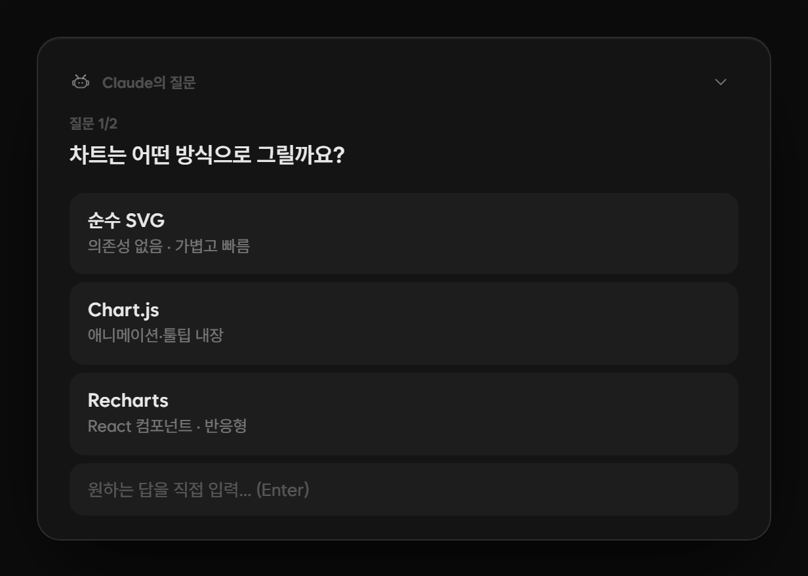

<sub>질문 카드 — 선택지 또는 직접 입력, 여러 질문은 단계별로</sub>

- **권한 카드** — 허용 · 이번 세션 동안 허용 · 거부. 권한 모드는 대화마다 일반 · 플랜 · 부분 허용 · 자동 허용 · 모두 허용 중에서 선택
- **결정이 남습니다** — 질문 답변과 계획 승인·거절이 대화에 기록되고, 다시 열어도 유지
- **Codex의 진행 중 질문도** — 작업을 억지로 중단하지 않고 카드에서 답하기. 전송에 실패하면 입력한 답을 유지해 다시 시도
- **사이드 질문** — Claude Code와 Codex 모두 `/btw 질문`으로 현재 대화의 맥락을 이어받은 별도 창을 엽니다. 본 작업은 계속 진행되고, 질문과 답변은 별도 창에서 이어집니다.

<br>

## 여러 에이전트를 나란히

한쪽에서 화면을 만들고, 다른 쪽에서 API를 붙이고, 또 다른 쪽에서 리뷰합니다. **최대 6개 패널**에 각각 다른 엔진·모델·추론 강도·권한 모드·계정·작업 폴더를 지정할 수 있습니다.

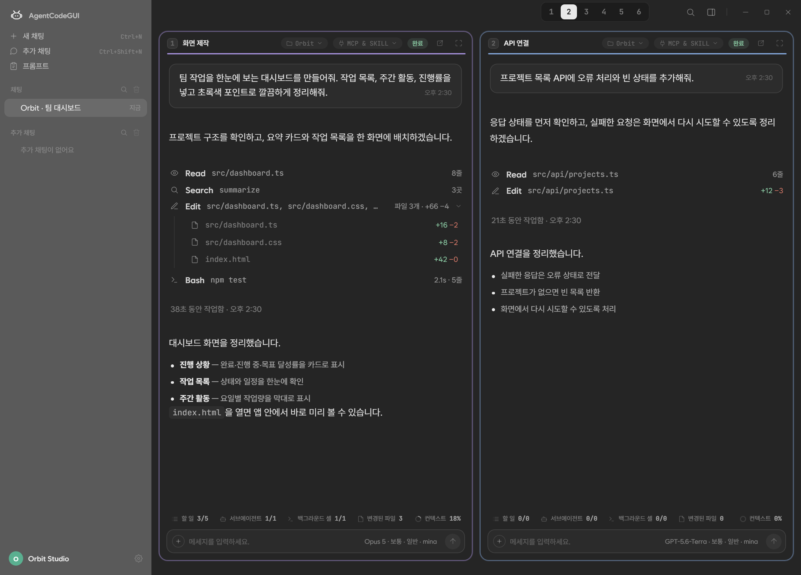

<sub>패널 2개 예시. 헤더의 1~6 다이얼로 늘립니다</sub>

- 패널 수를 1~6개로 바꾸고, 헤더를 끌어 순서를 바꾸고, 크게 보기나 **별도 창으로 팝아웃**
- 패널마다 자기 작업 바와 MCP & Skill 칩을 가지며, 접힌 자리의 대화는 그대로 보존
- 추가 채팅 창(`Ctrl+Shift+N`)을 다른 작업 옆에 두기
- 탐색기는 포커스된 패널의 폴더를 따라갑니다

<br>

## 계정과 한도는 앱이 관리합니다

Anthropic과 OpenAI 구독 계정을 여러 개 등록해 두고 대화마다 고릅니다. 카드마다 **5시간 · 주간 한도와 초기화 시각**이 게이지로 보이고(Anthropic 카드는 Fable 모델별 주간 한도까지), 초기화 임박순이나 한도 적게 남은순으로 정렬할 수 있습니다.

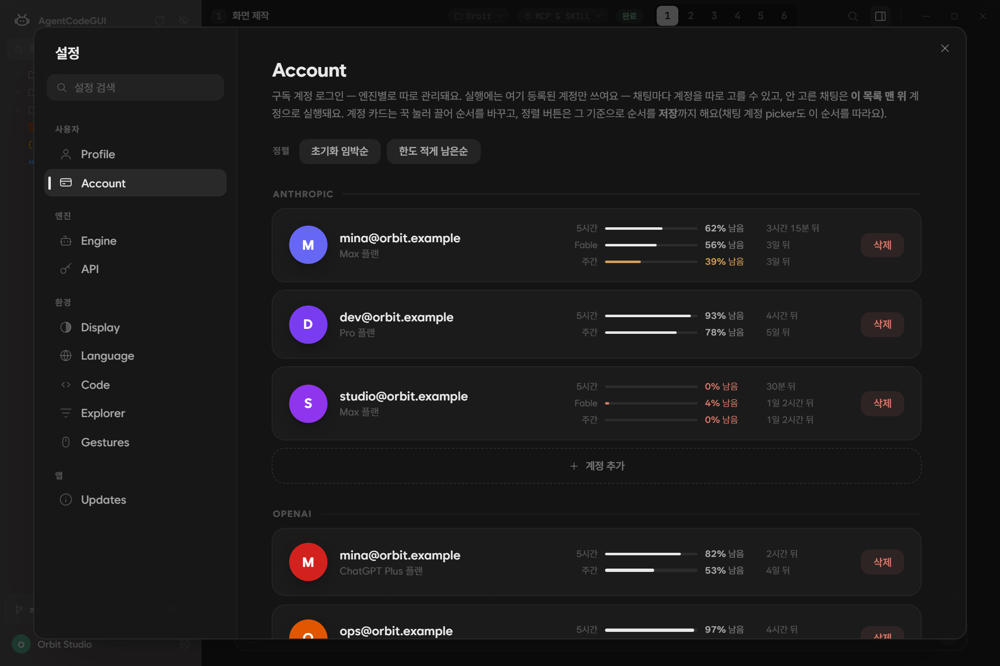

<table>
<tr>
<td width="50%" align="center">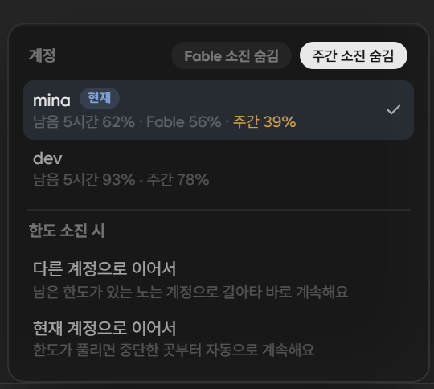</td>
<td width="50%" align="center">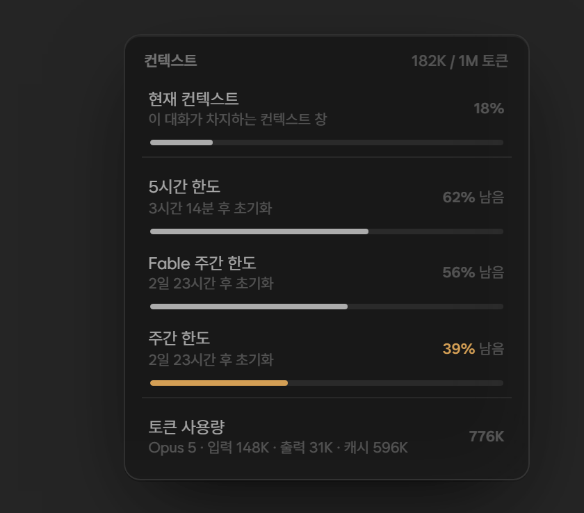</td>
</tr>
<tr>
<td align="center"><sub>대화 안의 계정 선택기 — 현재 계정 표시, 소진 계정 숨기기, 한도 소진 시 동작</sub></td>
<td align="center"><sub>컨텍스트 칩 — 컨텍스트 창 사용률과 이 계정의 남은 한도</sub></td>
</tr>
</table>

- **한도가 다 되면** 남은 한도가 있는 다른 계정으로 이어서 하거나, 현재 계정의 초기화 시각에 맞춰 중단한 곳부터 자동으로 재개
- **Codex 초기화권** — OpenAI 계정 카드에서 보유 수량을 누르면 지급·만료 등 제공되는 상세 정보를 보고 직접 사용할 수 있습니다. 결과를 확인하지 못한 요청은 같은 요청으로 재확인해 중복 사용을 방지합니다. 제공 여부는 계정과 Codex 버전에 따라 다릅니다
- **어느 자리가 어느 계정을 쓰는지** — 다른 패널이 같은 계정을 쓰면 「사용 중 · N번 자리」로 표시
- **API 키로도** — 설정 › API에 키를 등록하면 구독 없이 실행합니다. Anthropic 키는 대화별 비용·누적 사용액·예산까지 표시
- **자격증명은 앱 홈에 암호화(DPAPI) 저장**되며 터미널의 Claude Code·Codex 로그인과 섞이지 않습니다. 이미 설치된 CLI와 로그인을 그대로 쓰고 싶다면 아래 **시스템 환경**을 선택하세요

<br>

## 내 도구를 그대로

<table>
<tr>
<td width="40%" align="center">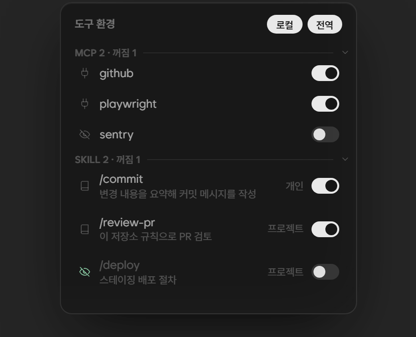</td>
<td width="60%" valign="top">

- **MCP 서버와 스킬**을 엔진이 보는 그대로 나열 — 전역(`~/.claude.json`, `~/.claude/skills`)과 프로젝트(`.mcp.json`, `.claude/skills`), 플러그인 스킬까지
- **로컬 · 전역 필터**로 목록을 좁히고, 지원되는 항목은 스위치로 켜고 끕니다. 앱은 사용자 설정 파일을 고쳐 쓰지 않습니다
- Codex도 계정과 작업 폴더의 MCP·스킬을 불러오며, 켬·끔은 계정별로 저장되어 다음 실행에 반영
- 스킬은 Claude의 `/`, Codex의 `$` 자동완성으로 입력. `@`로 파일 언급, 이미지·텍스트 첨부, 자주 쓰는 지시는 프롬프트 라이브러리에

</td>
</tr>
</table>

<br>

## 마무리는 Git으로

탐색기 아래 Git 스트립을 누르면 변경 목록과 커밋 컴포저가 열립니다. 커밋 메시지는 직접 쓰거나 **AI에게 맡깁니다**(Anthropic·OpenAI 제공업체, 계정·모델·사고 수준 선택).

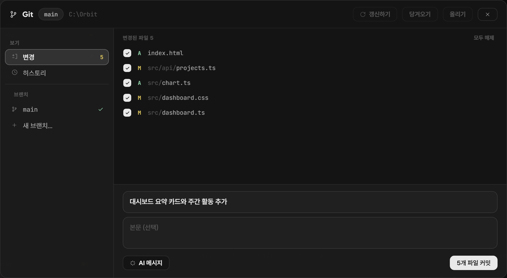

<sub>변경 — 파일을 고르고 메시지를 써서 커밋. 왼쪽에서 브랜치를 바꾸거나 새로 만듭니다</sub>

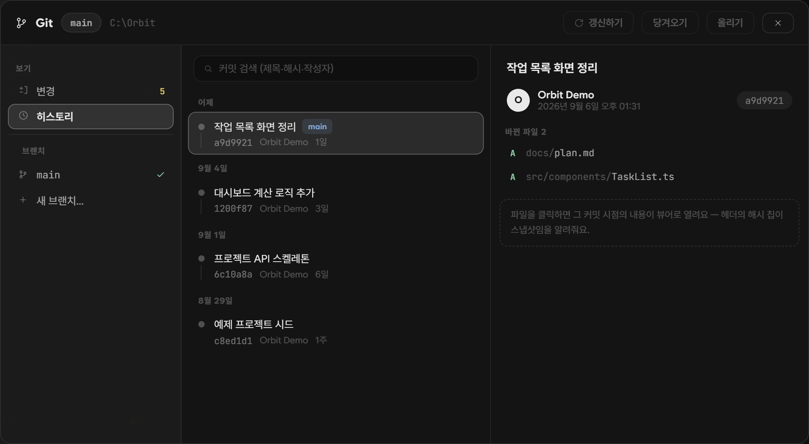

<sub>히스토리 — 커밋 상세와 그 시점의 파일</sub>

- 변경 파일 선택 → 커밋 → Pull · Push. 되돌리기와 더티 브랜치 전환은 확인 카드로 한 번 더
- 히스토리에서 커밋 상세와 **그 시점의 파일 스냅샷** 열기
- 브랜치 전환·생성, 하위 저장소가 여럿이면 저장소 선택
- 탐색기의 삭제는 휴지통으로 — 되돌릴 수 있습니다

<br>

## 엔진과 모델

| 엔진 | 연결 | 대화별 설정 |
|---|---|---|
| **Claude Code** · Anthropic | Claude 구독 계정 또는 API 키 | 모델 · 추론 강도 · 권한 모드 |
| **Codex CLI** · OpenAI | ChatGPT 구독 계정 또는 API 키 | 모델 · 추론 강도 · 속도 옵션(지원 모델) |

- **앱 관리 환경** — 앱이 엔진을 설치·업데이트합니다. 설정 › Engine에서 버전을 고르고 이전 버전을 정리할 수 있습니다 (설치에는 Node.js의 npm이 필요)
- **시스템 환경** — PC에 이미 설치된 CLI와 그 로그인·설정을 그대로 사용합니다. 실행 파일과 설정 폴더를 자동 감지하거나 직접 지정. 환경을 바꾸면 앱을 다시 시작한 뒤 새 대화부터 적용됩니다
- 출력 스타일(Concise · Explanatory · Learning 등)도 설정 › Engine에서 고릅니다

**Codex 컨텍스트도 모델별로 조절합니다.** 설정 › Engine에서 채팅에 표시되는 모델마다 컨텍스트 크기와 자동 압축 기준을 확인하세요. 처음에는 **기본값**을 사용하고, 필요한 사람만 **추천값**을 선택해 저장하거나 **직접 설정**합니다. 추천값은 현재 Astra에 512,000 / 430,000 토큰을 적용하며 다른 모델은 기본값을 유지합니다.

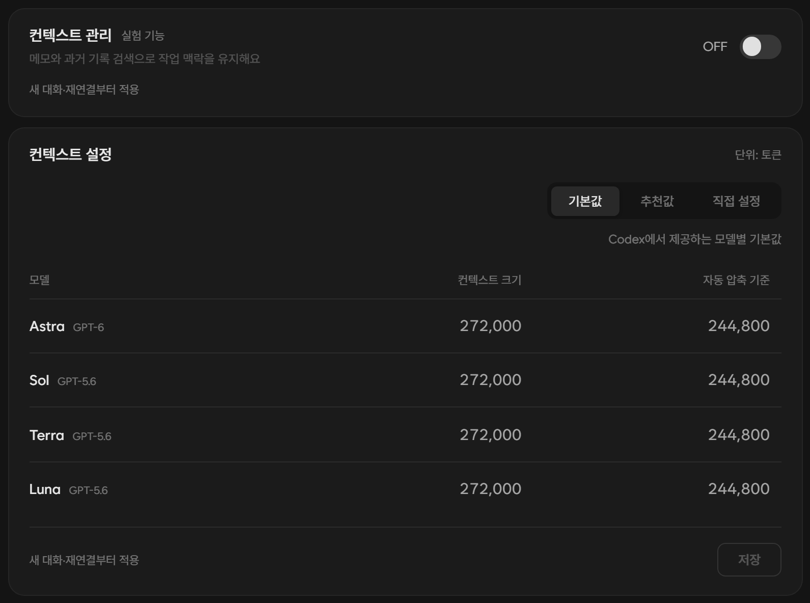

<sub>컨텍스트 관리는 별도의 실험 기능으로 처음에는 OFF입니다. 스위치는 자동 저장, 모델별 크기는 저장 버튼으로 반영하며 두 설정 모두 새 대화·재연결부터 적용됩니다</sub>

메모와 과거 기록 검색을 사용하는 **컨텍스트 관리**와 **컨텍스트 크기 설정**은 독립적으로 켜고 조절합니다. 기존 Codex 설정 파일은 그대로 유지합니다. 대화의 컨텍스트 게이지는 엔진이 보고한 실제 사용 가능 용량을 표시하므로 입력한 값과 다를 수 있습니다.

<br>

<details>
<summary><b>그 밖의 기능 — 펼쳐 보기</b></summary>
<br>

| 영역 | 기능 |
|---|---|
| **대화** | `Ctrl+F` 대화 검색 · 보낸 메시지 다시 불러오기 · 선택 텍스트 툴바(복사 · 번역 · 더 자세히) · `/clear` `/compact` `/init` 결과 카드 · 이미지 라이트박스 · 링크는 기본 브라우저로 · `Ctrl+휠` 줌 · 마우스 제스처 |
| **기록소** | 대화·명령·도구 원문과 실제 파일 사본 보관 · 변경 전후 보기 · 세션 검색·이름 변경·삭제 · 다른 컴퓨터로 세션 폴더 가져오기 · [사용 안내](docs/conversation-archive.md) |
| **번역** | 현재 세션의 제공업체·계정으로 선택 문장 번역 · 결과 복사·언어 변경 · 설정 › Translation에서 기본 언어·모델·사고 수준·지원 속도 선택 |
| **뷰어** | 코드 선택 후 바로 질문 · 뷰어 찾기 · 파일 히스토리(뒤로 / 앞으로) · 최대화 · 별도 OS 창(위치 기억) · 큰 파일 부분 표시 · Git 커밋 시점 스냅샷 |
| **탐색기** | 파일 검색 · 숨김 항목 필터 · 새 파일 / 폴더 · 이름 변경 · 경로 복사 · 파일 탐색기에서 보기 · 변경된 파일 보기 · 하위 저장소 폴더 우클릭으로 Git 추적 |
| **창 · 시스템** | 아크릴 유리 효과 · 사이드바 자동 숨김 · 닫기 버튼은 트레이로 · 알림 토스트(집계) · 한국어 / 영어 UI · 설정 › Updates에서 앱 업데이트와 패치노트 |
| **안정성** | 대화 중 계정·모델·모드를 바꿔도 꼬이지 않도록 엔진 상태를 앱이 관리 · 화면이 죽어도 앱이 스스로 복구 · 앱 종료 시 자식 프로세스까지 정리 · 응답 없음이 길어지면 진단 파일 자동 기록 |

</details>

<br>

## 설치하기

설치 순서는 위 [빠른 시작](#빠른-시작)의 네 단계가 전부입니다. 아래는 그 밖에 알아 두면 좋은 것들입니다.

- **파일** — [최신 릴리스](https://github.com/UnrealFactory/AgentCodeGUI/releases/latest)의 `AgentCodeGUI3_<버전>_x64-setup.exe`, 약 30 MB. 현재 사용자 계정에만 설치되며 위치는 `%LOCALAPPDATA%\AgentCodeGUI3`입니다.
- **업데이트** — 앱 안 **설정 › Updates**에서 확인하고 설치합니다. 패치노트도 같은 곳에서 다시 볼 수 있습니다.
- **제거** — Windows 설정 › 앱에서 AgentCodeGUI3를 제거합니다. 대화와 설정이 든 `~/.agentcodegui3`는 남으니 필요하면 직접 지웁니다.

<details>
<summary>설치 시 Windows SmartScreen 안내가 표시된다면</summary>
<br>

현재 배포 파일에는 Windows 코드 서명 인증서가 적용되어 있지 않습니다. 공식 릴리스에서 받은 파일인지 확인한 뒤 **추가 정보 → 실행**으로 설치할 수 있습니다. 앱 내 자동 업데이트는 별도의 업데이트 서명으로 검증합니다.

</details>

<details>
<summary>자주 묻는 질문</summary>
<br>

**구독 계정과 API 키 중 무엇을 써야 하나요?**<br>
둘 다 됩니다. 구독 계정은 앱이 한도를 추적하고 소진 시 전환·재개를 도와줍니다. API 키는 종량 과금이며, Anthropic 키는 대화별 비용·누적 사용액·예산을 표시합니다.

**터미널에서 쓰던 Claude Code 로그인이 그대로 쓰이나요?**<br>
기본(앱 관리) 환경에서는 앱 홈(`~/.agentcodegui3`)에 따로 로그인하며 터미널 로그인과 분리됩니다. 설정 › Engine에서 **시스템 환경**을 고르면 PC의 CLI와 로그인·설정을 그대로 씁니다.

**내 데이터는 어디에 저장되나요?**<br>
대화, 설정, 계정 정보는 모두 로컬 `~/.agentcodegui3`에 있고, 계정 토큰은 Windows DPAPI로 암호화됩니다. 대화 내용은 엔진(Claude Code · Codex CLI)만 보냅니다. 앱이 그 밖에 직접 통신하는 곳은 Anthropic의 로그인·사용량 API(OpenAI 쪽은 Codex CLI가 처리), GitHub(업데이트 확인), 화면 글꼴을 받는 jsDelivr·Google Fonts, 그리고 선택했을 때만 npm 레지스트리(앱 관리 엔진 설치)와 GitHub·NuGet(언어 서버 설치)입니다. 별도의 분석·텔레메트리 서버는 없습니다.

**엔진을 설치하려면 무엇이 필요한가요?**<br>
앱 관리 환경에서는 Node.js(npm)가 필요합니다. 이미 CLI가 설치돼 있다면 시스템 환경으로 연결해 npm 없이도 쓸 수 있습니다.

**2.6.x를 쓰고 있었는데요?**<br>
3.x는 별도 앱으로 나란히 설치되며 2.6.x는 그대로 남습니다. 앱 홈이 `~/.agentcodegui3`로 분리되어 대화와 로그인은 넘어오지 않으니 한 번 다시 로그인해 주세요. 2.x의 자동 업데이트로는 3.x를 받을 수 없어 릴리스 페이지에서 직접 설치해야 합니다.

**macOS나 Linux는요?**<br>
현재는 Windows 전용입니다. 앱은 Tauri 2로 만들어져 있어 다른 플랫폼을 막는 구조는 아니지만, 지금은 Windows에서만 검증하고 배포합니다.

</details>

<br>

## 개발하기

3.x는 **Tauri 2 · Rust · React · TypeScript**로 구성됩니다. Node.js 22 이상, Rust 1.82 이상, Windows C++ 빌드 도구가 필요합니다.

```bash
npm install
npm run tauri:dev              # 개발 앱 실행
npm run typecheck:app          # 렌더러 타입 검사
cargo test --workspace         # Rust 테스트
npm run tauri:build:unsigned   # 로컬 확인용 설치 파일
```

| 경로 | 역할 |
|---|---|
| `app/src` | React 렌더러 — 채팅, 멀티 패널, 뷰어, 설정 |
| `src-tauri` | 앱 셸 — 창, 트레이, IPC 디스패처, 엔진 허브, 업데이터 |
| `crates/ccg-engine` | Claude Code · Codex CLI 드라이버와 턴 상태기계 |
| `crates/ccg-auth` | 계정 저장소, 로그인, 사용량 API, 한도 전환 |
| `crates/ccg-store` · `ccg-fs` · `ccg-lsp` | 저장소, 파일 시스템과 Git, 언어 서버 |
| `src/shared/protocol.ts` | 렌더러와 셸이 공유하는 IPC 계약 |

배포용 빌드는 업데이트 서명 키를 설정한 뒤 `npm run tauri:build`로 만듭니다. README의 화면은 `node scripts/readme-screenshots.mjs`로 다시 촬영합니다. 격리된 홈과 가짜 CLI 대본으로 실제 앱을 구동하므로 계정이나 모델 호출 없이 재현됩니다.

<br>

---

<div align="center">

**함께 더 쓰기 좋은 앱을 만들어요.** [버그와 아이디어](https://github.com/UnrealFactory/AgentCodeGUI/issues)를 남겨주세요. 마음에 든다면 [⭐ Star](https://github.com/UnrealFactory/AgentCodeGUI/stargazers)로 응원해주세요.

[MIT License](LICENSE)

</div>
